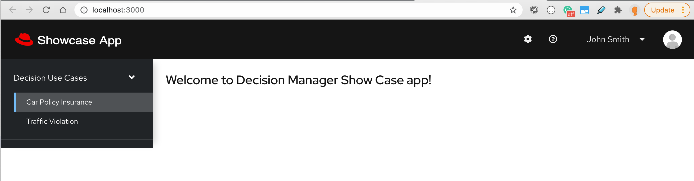
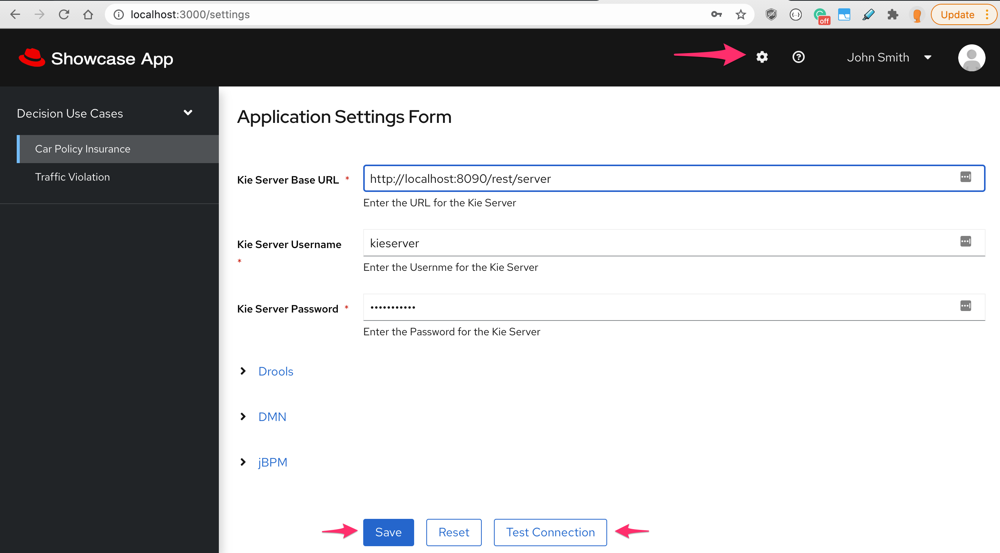
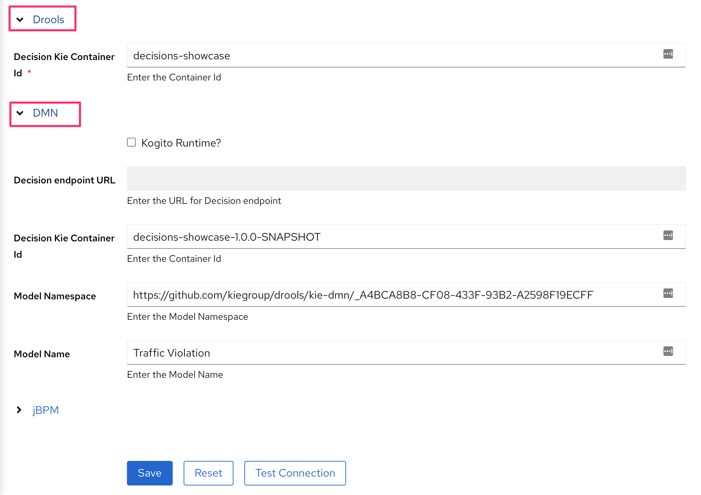
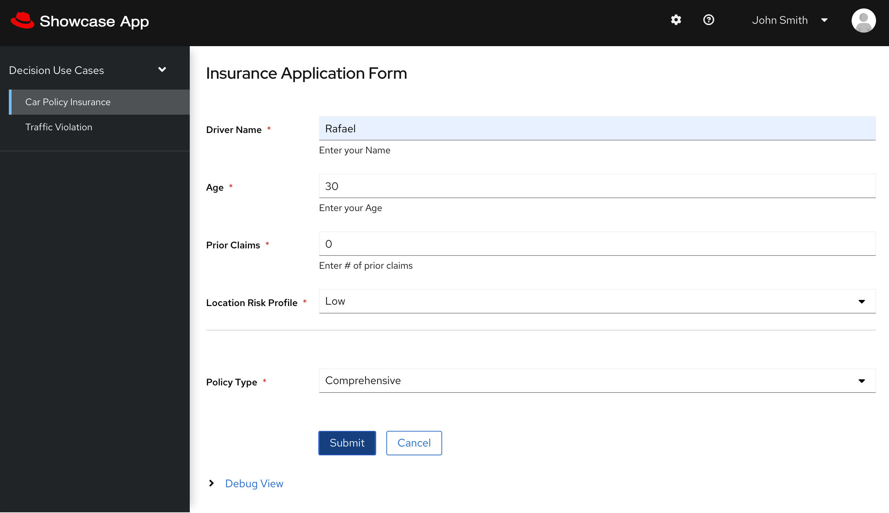
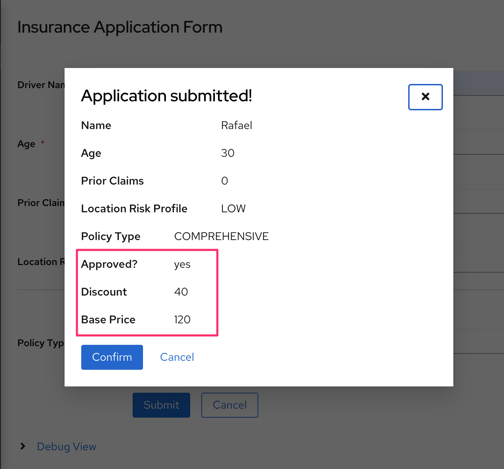
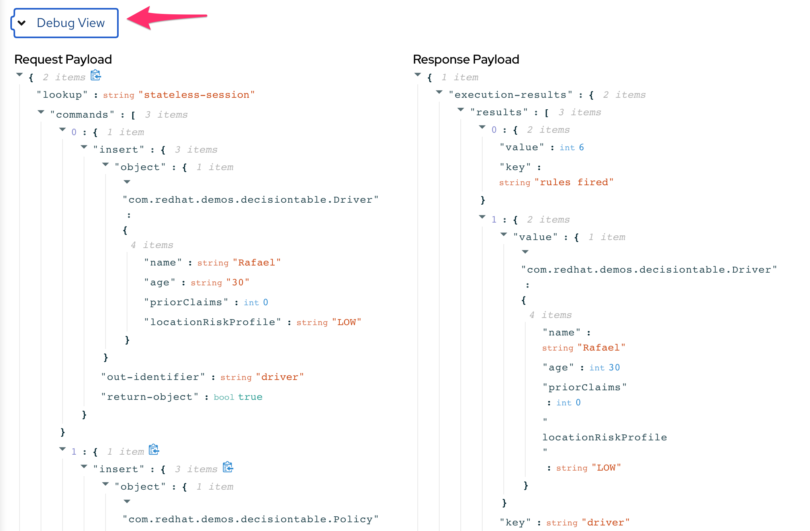
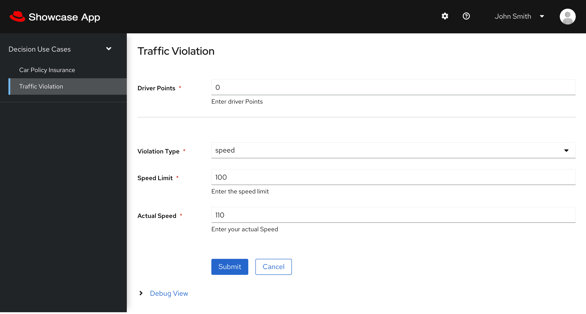
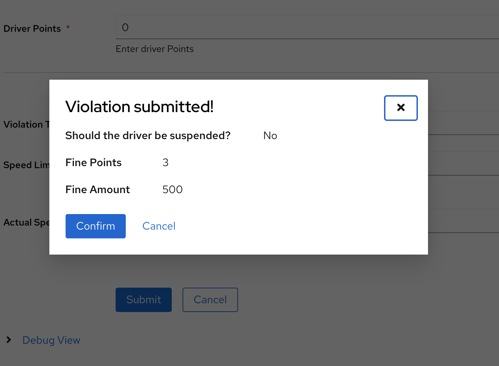

This project was bootstrapped with [Create React App](https://github.com/facebook/create-react-app).

## Available Scripts

In the project directory, you can run:

### `yarn start`

Runs the app in the development mode.<br />
Open [http://localhost:3000](http://localhost:3000) to view it in the browser.



The page will reload if you make edits.<br />
You will also see any lint errors in the console.

## Generating a Container Image

Use the [source-to-image](https://github.com/openshift/source-to-image) CLI tool to easily generate an image containing your react app. 

 * `s2i` CLI build usage
```
Usage:
  s2i build <source> <image> [<tag>] [flags]
```

 * using the [Nodeshift s2i base image](https://hub.docker.com/r/nodeshift/ubi8-s2i-web-app)

```
s2i build . nodeshift/ubi8-s2i-web-app:latest rafaeltuelho/business-application-webclient
```

 * to run this container
```
docker run -d --name business-application-webclient -p 3000:8080 rafaeltuelho/business-application-webclient
```

  * the UI should be accessible at http://localhost:3000

## Deploying on Openshift

```
   $ oc new-app quay.io/rafaeltuelho/business-application-webclient -n rhpam-sandbox 
   $ oc expose service/business-application-webclient
   $ echo "$(oc  get route business-application-webclient --template='http://{{.spec.host}}')"
```

## Demo the Sample Use Cases
The first thing you need to do is enter the connection settings to your Kie Server service.
Click on the Gear icon located at the top right of the app to open the **Settings** page.

 * Enter the Kie Server Rest API URL and the credentials (`kieserver/kieserver1!`)



 * Click on the Drools and DMN link and enter the Kie (container) Deployment Unit details



Click on `Test Connection` button and then `Save`

### Drools Business Rules
This use case makes use of a Drools Decision Table implemented using a [XLS Spreadsheet representation](https://github.com/rafaeltuelho/my-business-automation-showcase/blob/37d63ac7ef5397c4892a6ba8b6fab7630c07b5b3/decisions-showcase/src/main/resources/com/redhat/demos/decisiontable/ExamplePolicyPricing.xls)



  * Enter the input data and hit `Submit` to see the Decision Service's response.



  * You can also see the client request and server response payload clicking on `Debug` link at the bottom of the web form.



### DMN Models

There are two Decision Models you can play with:
 1. [Traffic Violation](https://github.com/rafaeltuelho/my-business-automation-showcase/blob/d37e4073e0a278da22ff517dc8422279c2b427d8/decisions-showcase/src/main/resources/com/redhat/demos/dmn/Traffic%20Violation.dmn)
   
 

 2. [Loan Approval](https://github.com/rafaeltuelho/my-business-automation-showcase/blob/master/decisions-showcase/src/main/resources/com/redhat/demos/dmn/Loan%20Approval.dmn)

  * choose the decision model from the Dropdown and fill the data input form rendered.
  * hit `Submit` to see the Decision Service's response.

