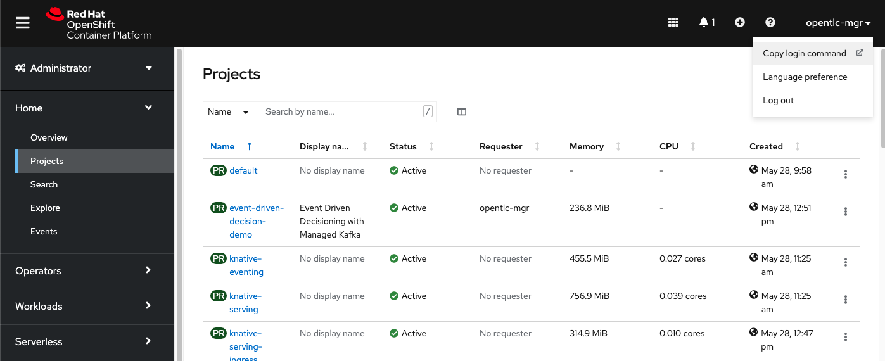
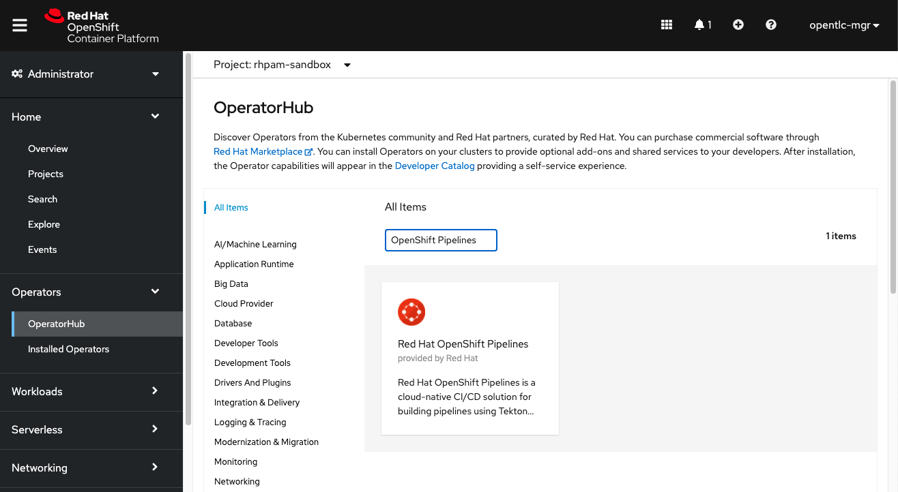

# CICD Demo Provisioning and testing

## Pre-requisites

* OpenShift 4.6+ (with admin access to install operators)
* Git client on your local machine ( download at https://git-scm.com/downloads)
* GitHub account ( http://github.com/) 
* OpenShift oc client ([Where to download oc client](https://developers.redhat.com/openshift/command-line-tools))

## Demo Provisioning

### Preparing the environment

1. Log in to your OpenShift cluster in your terminal. You can copy the login command by using the option below in your OpenShift web UI.
	
2. Create an Openshift Project
   `oc new-project rhpam-sandbox`
3. Install OpenShift Pipelines Operator in your Cluster. 
   1. To install it, using the **Administrator View**, navigate to **Operators** -> **Operator** Hub menu. 
   2. In the text field, search for OpenShift Pipelines, select the Operator that will show up. 
       
   3. Click **Install**. On the next screen you can use the default values, and click on **Install** again.
4. While the operator is installing, fork and clone this repo to your local machine. Access the folder directory so we can start deploying the pipeline definitions.

```
$ git clone https://github.com/${yourgithubuser}/my-business-automation-showcase.git
$ cd my-business-automation-showcase
```

### Creating the Tekton resources into your project namespace

1. Run the following oc command to create the pipeline resources:

```
$ oc create -f ./cicd/tekton-resources/ -n rhpam-sandbox

configmap/custom-maven-settings created
eventlistener.triggers.tekton.dev/ba-cicd-event-listener created
persistentvolumeclaim/maven-repo-pvc created
task.tekton.dev/mvn-jkube created
task.tekton.dev/mvn created
pipeline.tekton.dev/ba-cicd-pipeline created
persistentvolumeclaim/source-workspace-pvc created
triggerbinding.triggers.tekton.dev/ba-cicd-trigger-binding created
triggertemplate.triggers.tekton.dev/ba-cicd-trigger-template created	
```

The following resources should be created in your namespace:

* PVCs for maven and git repos
	* maven-repo-pvc
	* shared-workspace
* ConfigMap with a custom Maven settings.xml
* Tekton Resources
	* Event Listener
	* Triggers
	* Template
	* Binding
	* Tasks
	* Pipeline

You can confirm this by opening the OpenShift Console using the Developer perspective, and accessing Pipelines menu. You should see the `ba-cicd-pipeline`


Click the `ba-cicd-pipeline` to see its details with a graphical representation.


### Creating the webhook to trigger pipelines automatically

1. Expose the `Pipeline Event Listener`. In order to trigger a *Pipeline Run* with a *Git Push event* you need to expose your `Pipeline EventListener`:

```
$ oc expose svc el-ba-cicd-event-listener -n rhpam-sandbox
route.route.openshift.io/el-ba-cicd-event-listener exposed	
```

2. Open the Topology view in the Developer Dashboard to see the Trigger Event Listener POD

<p align="center">
  
</p>


This is the service that listens to your git hook events (via webhooks)!

3. Get your EventListener URL using the following command:

```
$ echo "$(oc  get route el-ba-cicd-event-listener --template='http://{{.spec.host}}')"
http://el-ba-cicd-event-listener-rhpam-sandbox.your.cluster.domain.com
```

#### Configuring GitHub Webhooks 
1. Open the your project's setting in GitHub and access the Webhooks menu.
2. Click on the. "Add Webhook" button and enter your password if requested.
   * Set the **Payload URL** with the **Pipeline EventListener** URL copied previously. 
   * Set the Content type as `application/json`
   * Once finished, click on the green button "Add Webhook".
      

## Testing your environment

### Trigger the Pipeline execution

Let's do some changes on the project and push it to the git repository to see the pipeline in action. You can use VSCode and the Business Automation extension to support these next steps.

1. Open your decision service project in VSCode:
   `$ code decisions-showcase/`
3. Open a decision asset and change one of the values. For example, you can open the `Loan Approval.dmn` or the  `rulebase.drl` file under the resources folder, and update one of the rules' or decision's values. Save the file.
4. Adjust any unit tests accordingly to the changes below.
5. Back to the terminal (or using VScode Git extension), commit and push.

```
$ git add .
$ git commit -am "applying some changes"
$ git push origin master
```

5. Open GitHub UI, and in the project's **Settings**, under the **Webhooks** menu, you can confirm the **git push webhook** previously configured for your repo is activated. Click on your webhook and scroll down to see the recent deliveries. 
   


6. In OpenShift, you can confirm that consequently a new **Pipeline Run** was be triggered as well.
   

7. Using the Administrator Perspective, you can access **Pipelines** -> **Pipelines** ->**ba-cicd-pipeline**  ->  **Pipeline Runs** tab to see your Pipeline executions
   

8. Click on the active execution to follow the run status:
	

9. Click on the `Logs` tab to see the output of each individual task execution
	


## Accessing the Business Application Service

At the end of the Pipeline execution you should have two instances of your Kie Server running on Spring Boot containers.


1. Click on the POD edge arrow to open the public App Route URL

<p align="center">
  
</p>

You should see the sample Business Application Service home page


exposing the standard Kie Server API *(user: wbadmin, passwd: wbadmin)*


## Build a custom Tekton Maven Task image
To be able to use JKube Maven Plugin I extended the standard Tekton Maven image to include the `oc` CLI tool.

```
docker build -f docker/mvn-with-oc-task.dockerfile \ 
--no-cache \ 
--build-arg OC_PKG_URL="https://mirror.openshift.com/pub/openshift-v4/clients/oc/latest/linux/oc.tar.gz" \
-t quay.io/rafaeltuelho/mvn-kube-oc:openjdk-11 .
```

> NOTE: this image is publicly available in my Quay.io repo: https://quay.io/repository/rafaeltuelho/mvn-kube-oc
> No need to do anything here.

## Clean up your namespace
To delete the application provisioned y the Pipeline Run, execute the following command.

```
oc delete all -l provider=jkube -n <namespace>

pod "business-application-service-1-9nl6j" deleted
pod "business-application-service-1-tnqth" deleted
replicationcontroller "business-application-service-1" deleted
service "business-application-service" deleted
deploymentconfig.apps.openshift.io "business-application-service" deleted
buildconfig.build.openshift.io "business-application-service-s2i" deleted
build.build.openshift.io "business-application-service-s2i-1" deleted
imagestream.image.openshift.io "business-application-service" deleted
route.route.openshift.io "business-application-service" deleted
```