# CICD Demo script

## Setup

 1. Create an Openshift Project

 2. Install Tekton/Pipeline Operator in your Cluster

 3. Fork and Clone this repo

 4. Apply the Openshift Pipelines (Tekton) Resources

### 4.1 Create Tekton resources into your project namespace
```
oc create -f tekton-resources/

configmap/custom-maven-settings created
eventlistener.triggers.tekton.dev/ba-cicd-event-listener created
persistentvolumeclaim/maven-repo-pvc created
task.tekton.dev/mvn-jkube created
task.tekton.dev/mvn created
pipeline.tekton.dev/ba-cicd-pipeline created
persistentvolumeclaim/source-workspace-pvc created
triggerbinding.triggers.tekton.dev/ba-cicd-trigger-binding created
triggertemplate.triggers.tekton.dev/ba-cicd-trigger-template created	
```

The following resources should be created in your namespace:

* PVCs for maven and git repos
	* maven-repo-pvc
	* shared-workspace
* ConfigMap with a custom Maven settings.xml
* Tekton Resources
	* Event Listener
	* Triggers
	* Template
	* Binding
	* Tasks
	* Pipeline

If you open the Pipelines view in the Openshift Developer Dashboard you should see the `ba-cicd-pipeline`
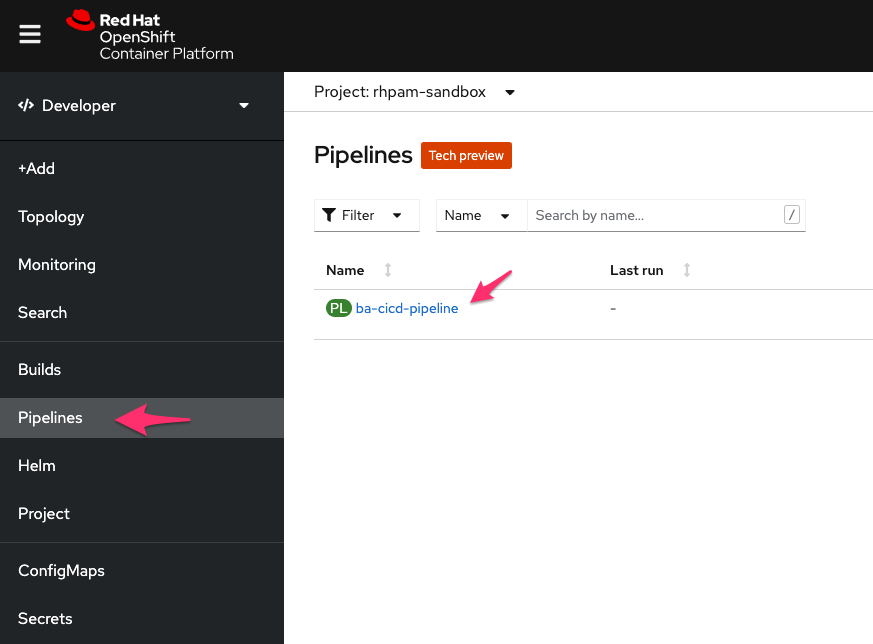

Click the `ba-cicd-pipeline` to see its details with a graphical representation.
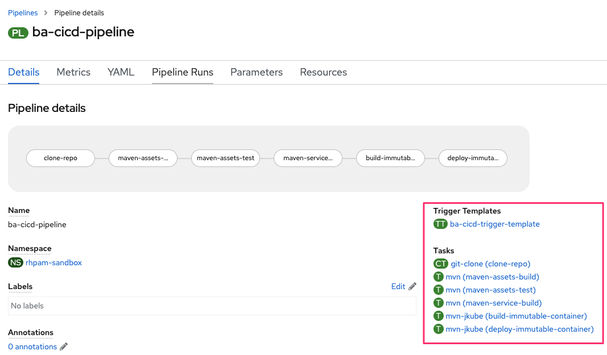

### 4.2 Expose the Pipeline Event Listener
In order to trigger a *Pipeline Run* with a *Git Push event* you need to expose your Pipeline **EventListener**

```
oc expose svc el-ba-cicd-event-listener
route.route.openshift.io/el-ba-cicd-event-listener exposed	
```

Open the Topology view in the Developer Dashboard to see the Trigger Event Listener POD
<p align="center">
  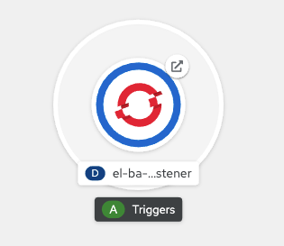
</p>


This is the service that listen to your git hook events (via webhooks)!

### 4.3 Create the Git Webhook to trigger your Pipeline
Get the EventListener URL:

```
echo "$(oc  get route el-ba-cicd-event-listener --template='http://{{.spec.host}}')"
http://el-ba-cicd-event-listener-rhpam-sandbox.your.cluster.domain.com
```

### 4.4 Go to the (forked) Project Settings in your github and add a Webhook. 
* Set the Payload URL with the Pipeline EventListener URL copied previously.
* Set the Content type as `application/json`

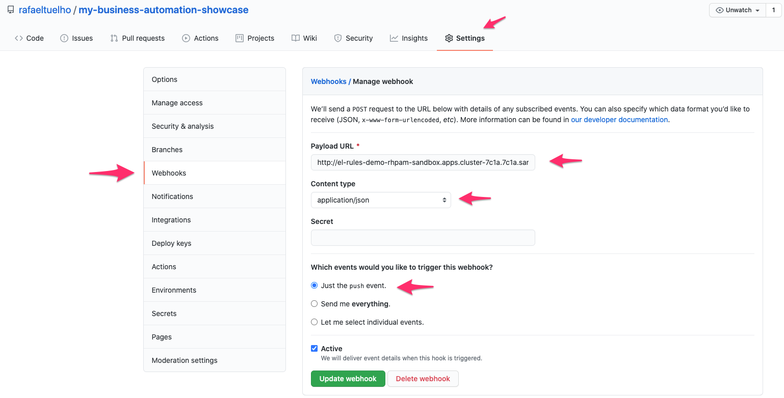 


### Trigger the Pipeline execution
 Open the [decisions-showcase](../decisions-showcase) project and make some changes in your Business Assets (eg: change a rule/decision definition) and push it to your git repo.
> **Remember** to change the artifact version in the `pom.xml`

```
  <groupId>com.redhat.demos</groupId>
  <artifactId>decisions-showcase</artifactId>
  <version>1.1.0-SNAPSHOT</version>
```

Commit and push
```
git commit -am "applying some changes"
git push origin master
```

At this point the **git push webhook** previously configured for your repo should be activated...
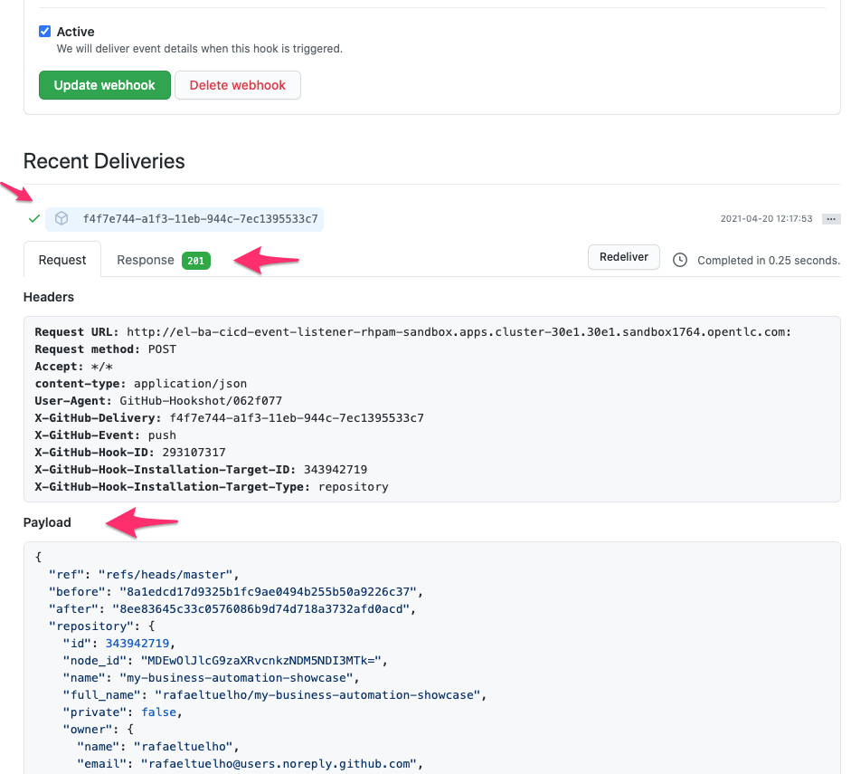

And consequently a new **Pipeline Run** should be trigged in the Openshift as well...
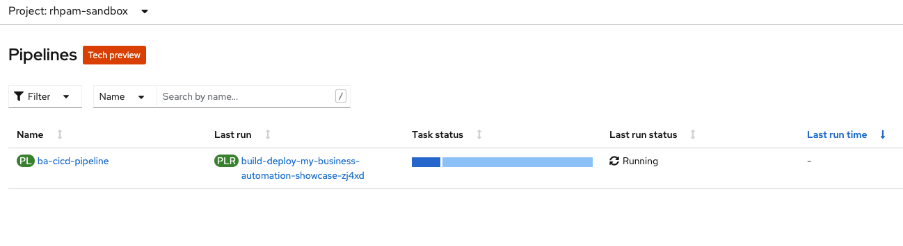

Click the `Pipeline Runs` tab to see your Pipeline executions
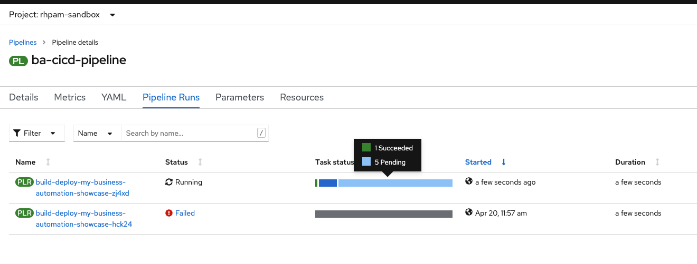

Click on the active execution to follow the run status
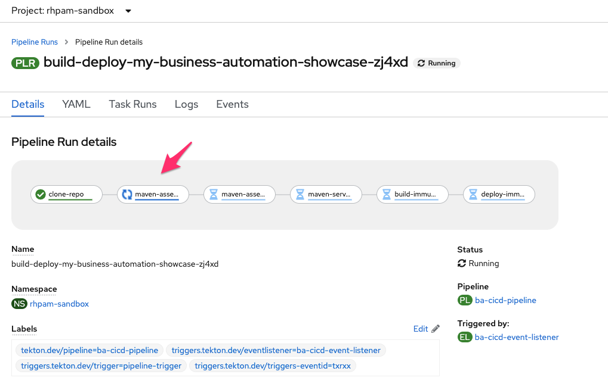

Click on the `Logs` tab to see the output of each individual task execution
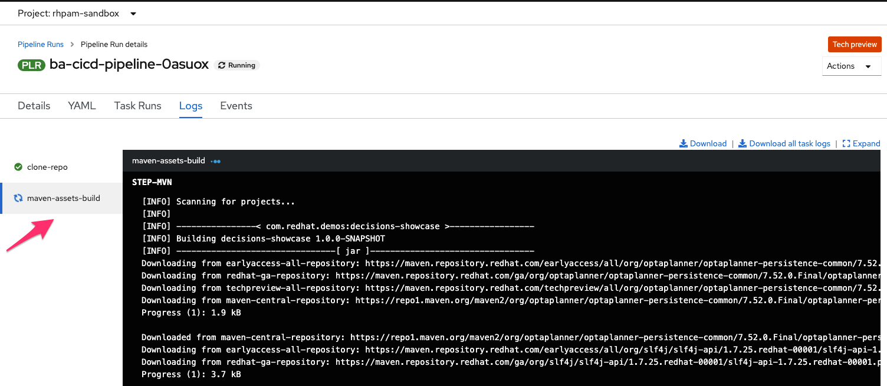

## Access the Business Application Service

At the end of the Pipeline execution you should have two instances of your Kie Server running on Spring Boot containers.
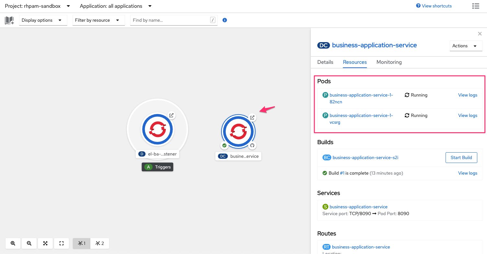

click on the POD edge arrow to open the public App Route URL
<p align="center">
  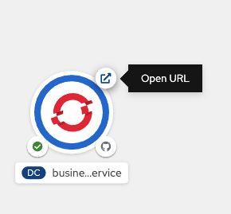
</p>

You should see the sample Business Application Service home page
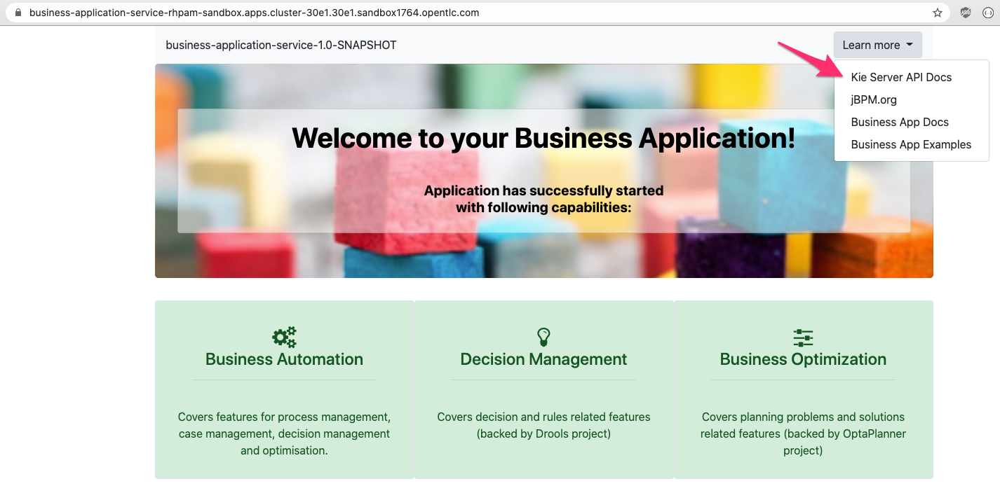

exposing the standard Kie Server API
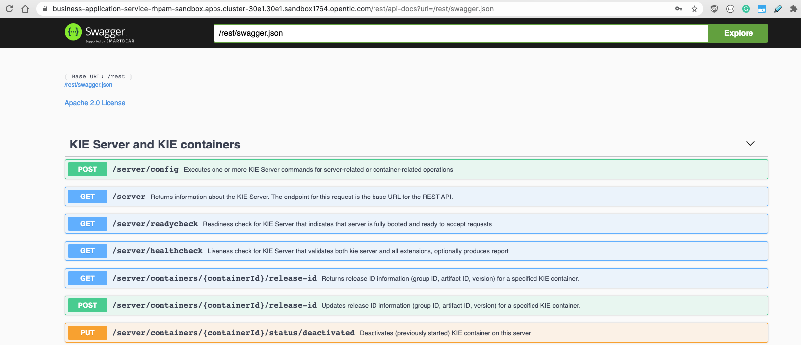

## Build a custom Tekton Maven Task image
To be able to use JKube Maven Plugin I extended the standard Tekton Maven image to include the `oc` CLI tool.

```
docker build -f docker/mvn-with-oc-task.dockerfile \ 
--no-cache \ 
--build-arg OC_PKG_URL="https://mirror.openshift.com/pub/openshift-v4/clients/oc/latest/linux/oc.tar.gz" \
-t quay.io/rafaeltuelho/mvn-kube-oc:latest .
```

> NOTE: this image is publicaly available in my Quay.io repo: https://quay.io/repository/rafaeltuelho/mvn-kube-oc
> No need to do anything here.

## Clean up your namespace
To delete the application provisioned y the Pipeline Run, execute the following command.

```
oc delete all -l provider=jkube -n <namespace>

pod "business-application-service-1-9nl6j" deleted
pod "business-application-service-1-tnqth" deleted
replicationcontroller "business-application-service-1" deleted
service "business-application-service" deleted
deploymentconfig.apps.openshift.io "business-application-service" deleted
buildconfig.build.openshift.io "business-application-service-s2i" deleted
build.build.openshift.io "business-application-service-s2i-1" deleted
imagestream.image.openshift.io "business-application-service" deleted
route.route.openshift.io "business-application-service" deleted
```