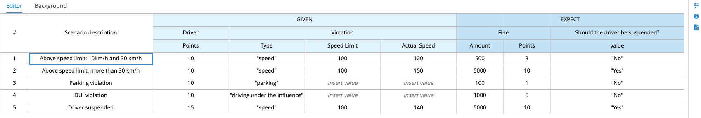

# Decision and Rules Project

This project was generated using my [kie-rules-archetype](https://github.com/rafaeltuelho/kie-project-archetypes) template (maven archetype).

It contains two decision/rules artifacts.

 1. a Car Insurance Policy Pricing Decision Table implemented using Drools XLS Spreadsheet.


 2. a Traffic Violation Decision implemented using DMN.


It also contains unit tests for both Drools and DMN rules and visual tabular _Test Scenario Simulation_. Execute the tests with `mvn test` to see the results.


## Building the kjar artifact
To build and install the kjar in  your local maven repository (`~/.m2/repository`)

```
mvn clean install -DskipTests
```

## Deploying your Rules 

Take a look at the [business-application-service](../business-application-service) instructions to see how you can deploy and run your kjar using the Immutable Kie Server Spring Boot runtime in your local environment. 
## Executing your Decision Service

after building and deploying your kjar into a kie-server you can test the API using the following payload samples:

### DMN Decision

`GET`  http://localhost:8080/kie-server/services/rest/server/containers/decisions-showcase-1.0.0-SNAPSHOT/dmn

> if running on Spring Boot use this url: http://localhost:8090/rest/server/server/containers/decisions-showcase-1.0.0-SNAPSHOT/dmn

copy the `model-namespace` and the `model-name`

`POST` http://localhost:8080/kie-server/services/rest/server/containers/decisions-showcase-1.0.0-SNAPSHOT/dmn

Payload:

```json
{
  "model-namespace": "https://kiegroup.org/dmn/_4502BB15-E55D-4302-91EA-CFD7E2EA470C",
  "model-name": "Loan Approval",
  "decision-name" : [ ],
  "dmn-context" : 
    {
        "Credit Score" : 800,
        "DTI" : 0.2
    }
}
```

Response:

```json
{
    "type": "SUCCESS",
    "msg": "OK from container 'rules-archetype'",
    "result": {
        "dmn-evaluation-result": {
            "messages": [],
            "model-namespace": "https://kiegroup.org/dmn/_4502BB15-E55D-4302-91EA-CFD7E2EA470C",
            "model-name": "Loan Approval",
            "decision-name": [],
            "dmn-context": {
                "Loan Approval": "Approved",
                "DTI": 0.2,
                "Credit Score": 800
            },
            "decision-results": {
                "_C970A1A1-83F1-4590-BE74-EF1E46558069": {
                    "messages": [],
                    "decision-id": "_C970A1A1-83F1-4590-BE74-EF1E46558069",
                    "decision-name": "Loan Approval",
                    "result": "Approved",
                    "status": "SUCCEEDED"
                }
            }
        }
    }
}
```

### XLS decision Table rule base

`POST` http://localhost:8080/kie-server/services/rest/server/containers/instances/decisions-showcase-1.0.0-SNAPSHOT

> if running on Spring Boot use this url: http://localhost:8090/rest/server/server/containers/instances/decisions-showcase-1.0.0-SNAPSHOT

Payload:

```json
{
    "lookup": "stateless-session",
    "commands": [
        {
            "insert": {
                "object": {
                    "com.redhat.demos.decisiontable.Driver": {
                        "name": "Mr Joe Blogs",
                        "age": 30,
                        "priorClaims": 0,
                        "locationRiskProfile": "LOW"
                    }
                },
                "out-identifier": "driver_fact_out",
                "return-object": true
            }
        },
        {
            "insert": {
                "object": {
                    "com.redhat.demos.decisiontable.Policy": {
                        "type": "COMPREHENSIVE",
                        "discountPercent": 0
                    }
                },
                "out-identifier": "policy_fact_out",
                "return-object": true
            }
        },
        {
            "fire-all-rules": {
                "max": -1,
                "out-identifier": "fired"
            }
        }
    ]
}
```

Response:

```json
{
    "type": "SUCCESS",
    "msg": "Container rules-archetype successfully called.",
    "result": {
        "execution-results": {
            "results": [
                {
                    "value": 3,
                    "key": "fired"
                },
                {
                    "value": {
                        "com.redhat.demos.decisiontable.Driver": {
                            "name": "Mr Joe Blogs",
                            "age": 30,
                            "priorClaims": 0,
                            "locationRiskProfile": "LOW"
                        }
                    },
                    "key": "driver_fact_out"
                },
                {
                    "value": {
                        "com.redhat.demos.decisiontable.Policy": {
                            "type": "COMPREHENSIVE",
                            "approved": false,
                            "discountPercent": 20,
                            "basePrice": 120
                        }
                    },
                    "key": "policy_fact_out"
                },
                {
                    "value": [
                        {
                            "com.redhat.demos.decisiontable.Driver": {
                                "name": "Mr Joe Blogs",
                                "age": 30,
                                "priorClaims": 0,
                                "locationRiskProfile": "LOW"
                            }
                        },
                        {
                            "com.redhat.demos.decisiontable.Policy": {
                                "type": "COMPREHENSIVE",
                                "approved": false,
                                "discountPercent": 20,
                                "basePrice": 120
                            }
                        }
                    ],
                    "key": "facts"
                }
            ],
            "facts": [
                {
                    "value": {
                        "org.drools.core.common.DefaultFactHandle": {
                            "external-form": "0:1:1664356063:1664356063:1:DEFAULT:NON_TRAIT:com.redhat.demos.decisiontable.Driver"
                        }
                    },
                    "key": "driver_fact_out"
                },
                {
                    "value": {
                        "org.drools.core.common.DefaultFactHandle": {
                            "external-form": "0:2:1235907157:1235907157:2:DEFAULT:NON_TRAIT:com.redhat.demos.decisiontable.Policy"
                        }
                    },
                    "key": "policy_fact_out"
                }
            ]
        }
    }
}
```
